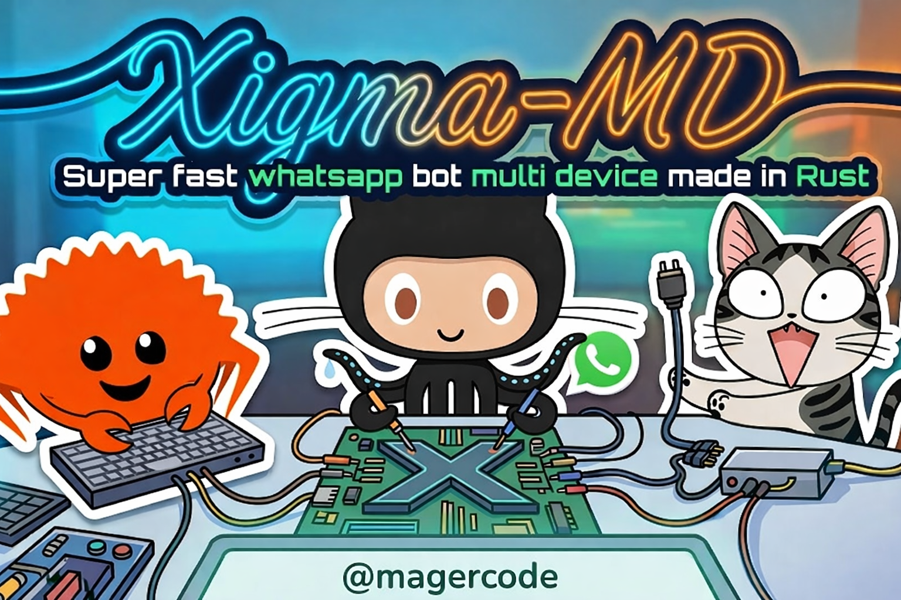

<div align="center">

# Xigma-MD
### Speed is a feature, and Rust is the engine.

Bot WhatsApp berbasis Rust dengan fokus pada performa, stabilitas runtime async, dan pipeline media yang cepat.



</div>

## 1) Ringkasan
Xigma-MD adalah WhatsApp bot yang dibangun dengan stack Rust async (`tokio`) di atas `whatsapp-rust`.

Fokus utama:
- respon command cepat,
- command media/downloader,
- kontrol owner yang ketat,
- pengaturan mode bot (`public` / `self`),
- guard anti-spam berbasis cooldown + penalty.

## 2) Fitur Utama
- Prefix command: `/`, `!`, `.`
- Login: `pairing code` atau `QR code`
- Menu command otomatis (dibangun dari `src/handler.rs`)
- Owner tools:
- tambah owner,
- ubah mode bot,
- ubah thumbnail bot,
- blacklist grup target.
- Group tools:
- ambil ID grup,
- broadcast ke semua grup (support text/reply media),
- kirim status grup massal (`swgc`).
- Media tools:
- sticker maker (`/sticker`, `/s`, `/stiker`),
- konversi sticker ke image/video (`/toimg`, `/tovid`).
- Downloader:
- YouTube search, MP3, MP4, play by query,
- Instagram reel/post downloader (`/igdl`).
- Command fun: `/dadu`, `/kapan`
- Debug command untuk owner (`/debug`/`/d`)

## 3) Arsitektur Singkat
- Entry point: `src/main.rs`
- Dispatcher command: `src/handler.rs`
- Controller per fitur: `src/controller/*`
- Konfigurasi runtime: `src/config.rs` + `config.ron`
- Helper media/message:
- `src/util/msg.rs` (reply/react/send media),
- `src/util/converter.rs` (ffmpeg + webpmux sticker pipeline),
- `src/util/igdl.rs` (Instagram API client).

Alur pesan:
1. Event message masuk dari WhatsApp.
2. `handler::dispatch` validasi prefix.
3. Validasi mode (`self/public`) dan anti-spam.
4. Routing ke controller sesuai command.
5. Controller balas text/media melalui helper.

## 4) Prasyarat
### A. Runtime & Toolchain
- Rust (disarankan versi modern yang sudah support Edition 2024)
- Cargo

### B. Dependensi sistem (wajib untuk fitur tertentu)
- `ffmpeg` (wajib untuk fitur sticker & konversi media)
- `webpmux` dari `libwebp-tools` (untuk inject EXIF sticker)
- `yt-dlp` (wajib untuk fitur YouTube downloader/search)

### C. Koneksi jaringan
- Wajib online untuk login WhatsApp, downloader, dan API IG.

## 5) Instalasi
1. Clone repo.
2. Masuk ke folder project.
3. Pastikan `config.ron` sudah valid.
4. Jalankan:

```bash
cargo run
```

Jika ingin validasi compile tanpa run:

```bash
cargo check
```

## 6) Konfigurasi `config.ron`
File: `config.ron`

Field utama:
- `NO_OWNER`: daftar nomor owner (harus LID login dulu bot nya baru gunakan /getlid <tag/reply> untuk dapetin lid)
- `NAMA_OWNER`: nama owner utama (metadata sticker)
- `NAMA_BOT`: nama bot
- `THUMBNAIL_URL`: thumbnail untuk beberapa reply/ad context
- `METHOD_LOGIN`: `pairing` atau `qrcode`
- `BOT_MODE`: `public` atau `self`
- `BLACKLIST_GROUP`: daftar JID grup yang di-skip saat broadcast/status massal

Contoh:

```ron
(
    NO_OWNER: ["160933095698680"],
    NAMA_OWNER: "adjisoft",
    NAMA_BOT: "Xigma-MD",
    THUMBNAIL_URL: "https://example.com/thumb.jpg",
    METHOD_LOGIN: "pairing",
    BOT_MODE: "public",
    BLACKLIST_GROUP: [],
)
```

## 7) Login Bot
Saat startup, method login dibaca dari `config.ron`:
- `pairing`: bot minta nomor WA, lalu tampilkan pairing code.
- `qrcode`: bot print QR ke terminal untuk dipindai.

Session disimpan di:
- `session/bot.db`
- `session/phone.txt`

## 8) Daftar Command
### Command umum
- `/menu`, `/help`
- `/ping`, `/speed`
- `/owner`, `/own`
- `/dadu`, `/roll`
- `/kapan`, `/when`, `/whenyah <teks>`
- `/igdl`, `/igreel`, `/instagram <url>`

### Command YouTube
- `/ytsearch <kueri>`
- `/ytmp3 <url_youtube>`
- `/ytmp4 <url_youtube>`
- `/play`, `/song <kueri lagu>`

### Command owner/moderasi
- `/debug`, `/d`
- `/addowner <tag|reply|nomor>`
- `/set <opsi> <value>`
- `/setthumb`, `/setthumbnail <url>`
- `/gid`, `/groupid`
- `/bl`, `/blacklist [id_grup]`
- `/bcg`, `/bcgroup`, `/broadcastgroup <teks/reply media>`
- `/gstatus`, `/swgc <teks/reply media>`

### Command sticker
- `/sticker`, `/s`, `/stiker`
- `/toimg`
- `/tovid`

## 9) Aturan Bot
### Mode bot
- `public`: semua user bisa pakai command.
- `self`: hanya owner + pesan dari akun bot sendiri yang bisa pakai command.

### Anti-spam command
Di `src/handler.rs`:
- jeda dasar command: 2 detik per user non-owner,
- pelanggaran beruntun menambah penalty delay progresif,
- penalty maksimum: 30 detik.

## 10) Struktur Folder Penting
- `src/main.rs`: bootstrap bot + event loop
- `src/handler.rs`: routing command
- `src/controller/`: implementasi command
- `src/util/`: helper converter/message/helper API
- `config.ron`: konfigurasi bot
- `session/`: data session login
- `message_debugs/`: output debug message owner

## 11) Troubleshooting
### `yt-dlp gagal: ...`
Pastikan `yt-dlp` terinstal dan tersedia di PATH.

### `gagal menjalankan ffmpeg`
Install `ffmpeg` dan pastikan command `ffmpeg` bisa dipanggil dari terminal.

### `webpmux tidak ditemukan`
Install paket `libwebp-tools` (atau paket setara di OS kamu).

### Bot tidak merespon command
Periksa:
1. Prefix benar (`/`, `!`, `.`)
2. `BOT_MODE` bukan `self` (kalau kamu bukan owner)
3. Tidak kena anti-spam cooldown.

## 12) Known Issues (status kode saat ini)
Per **5 Maret 2026**, `cargo check` masih gagal karena:
- import `crate::util::queue` belum tersedia,
- dependency `futures` belum ada di `Cargo.toml`,
- efek turunan di modul `src/controller/ytdl/commands.rs`.

Artinya, dokumentasi ini mencerminkan arsitektur/fitur yang dituju di source, tetapi build saat ini belum clean sampai issue tersebut dibereskan.

## 13) Catatan
Project masih dalam pengembangan aktif.

Komunitas:
- Telegram: https://t.me/xigma98
